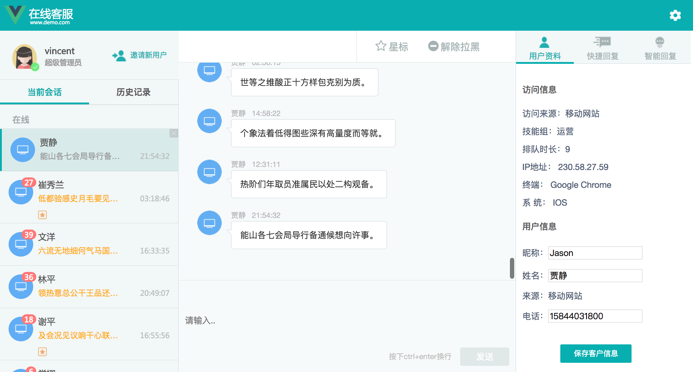

##技术栈
vue2 + vuex + vue-router + webpack + ES6/7 + mockjs + sass 
## 项目运行

``` bash
# install dependencies
npm install

# serve with hot reload at localhost:8080
npm run dev

# build for production with minification
npm run build

# build for production and view the bundle analyzer report
npm run build --report
```
## 界面



